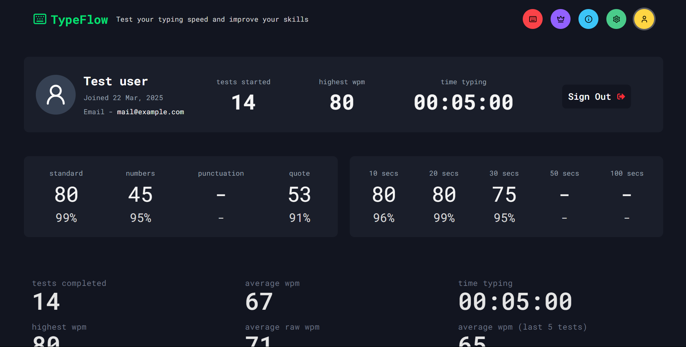
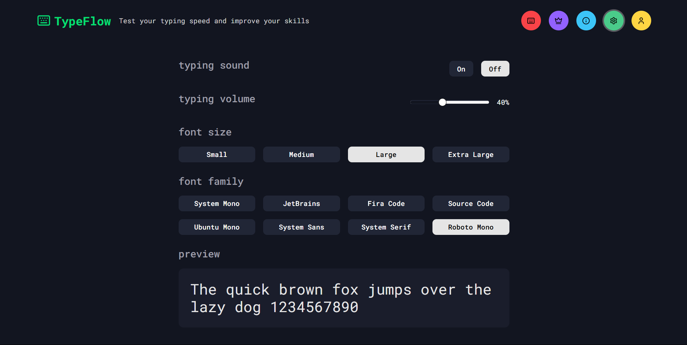

# TypeFlow

A sleek, feature-rich typing test application built with Next.js and TypeScript, designed to help users measure and improve their typing speed and accuracy.


## Features

### Core Functionality

- Real-time WPM (Words Per Minute) calculation
- Live accuracy tracking
- Dynamic performance graph
- Multiple test modes
- Customizable test duration
- Instant feedback on typing errors

### Test Modes

- Time-based tests (10s, 25s, 30s, 50s)
- Word count modes (10, 25, 40, 50 words)
- Difficulty levels (easy, medium, hard)
- Advanced modes (numbers, punctuation, quotes)

### Customization

- Multiple font families:
  - JetBrains Mono
  - Fira Code
  - Source Code Pro
  - Ubuntu Mono
  - System fonts (mono, sans, serif)
- Adjustable font sizes (small, medium, large, xl)
- Optional typing sound effects
- Adjustable volume

### Performance Metrics

- Net WPM
- Gross WPM
- Accuracy percentage
- Real-time performance graph
- Character error tracking

### Pages

- Home
- Leaderboard
- About
- Settings
- Profile

## Tech Stack

- Next.js 15 (App Router)
- TypeScript
- NextAuth
- Neon Postgre
- PostgreSQL
- Prisma
- Tailwind CSS
- Shadcn UI
- Framer Motion
- Chart.js
- Zustand (State Management)
- Zod
- Vercel (Deployment)

## Screenshots






## Getting Started

First, run the development server:

1. Clone the repository:

```bash
git clone https://github.com/akshansh029/typeflow.git
```

2. Install dependencies:

```bash
npm install
# or
yarn dev
# or
pnpm dev
# or
bun dev
```

3. Run the development server:

```bash
npm run dev
```

4. Open [http://localhost:3000](http://localhost:3000) in your browser

## Usage

- Press any key to start the test
- Type the displayed text
- Use Enter to restart the test
- View your results after completion
- Customize settings in the menu bar
- Change appearance in settings page

## Project Structure

```

├── app/
│ ├── settings/
│ ├── profile/
│ ├── about/
│ ├── leaderboard/
│ ├── api/
│ ├── favicon.ico
│ ├── globals.css
│ ├── layout.tsx
│ ├── loading.tsx
│ └── page.tsx
├── components/
│ ├── ui/
│ ├── FormSuccess.tsx
│ ├── FormError.tsx
│ ├── Header.tsx
│ ├── Socials.tsx
│ ├── CardWrapper.tsx
│ ├── RegisterForm.tsx
│ ├── LoginForm.tsx
│ ├── BackButton.tsx
│ ├── Menu.tsx
│ ├── Navbar.tsx
│ ├── PerformanceGraph.tsx
│ └── TypingTest.tsx
├── hooks/
├── lib/
│ ├── db.ts
│ ├── store.ts
│ └── utils.ts
├── utils/
│ ├── calculations.ts
│ └── words.ts
├── public/
│ └── sounds/
├── .env
├── next.config.js
├── package.json
├── postcss.config.js
├── tailwind.config.ts
└── tsconfig.json
```

## Contributing

Contributions are welcome! Please feel free to submit a Pull Request.

## Acknowledgments

- Inspired by MonkeyType
- Font families provided by Google Fonts
- Word lists curated for typing practice
